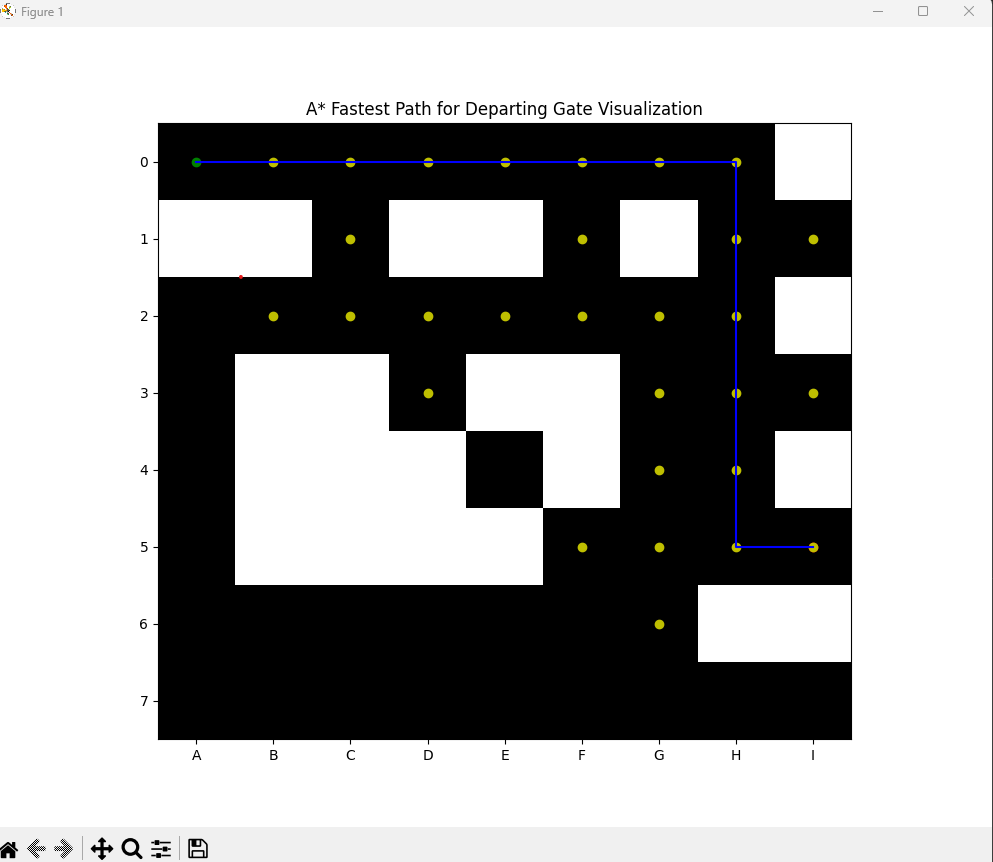

# CPSC481-03 A* Pathfinding Algorithm Visualization Project

    :
Marcilino Lamiy - Maromicho12@csu.fullerton.edu
Sumeet Singh - sumeet321@csu.fullerton.edu

This Python project demonstrates the A* pathfinding algorithm by visualizing the process of finding the shortest path from a starting point to a goal point on a grid-based maze.

## Overview

The A* Pathfinding Algorithm Visualization method is a well-known pathfinding technique that is used in games, robotics, and mapping, etc. It efficiently determines the shortest path from a start node to a target node on a graph, taking into consideration both the cost of reaching each node and a heuristic that estimates the cost from the current node to the destination node.

This project allows users to enter a beginning and goal point on a maze represented by a grid of 0s and 1s, where 0 indicates an open area and 1 denotes an obstacle. The A* algorithm's process of determining the shortest path from the start to the destination point is then shown, with the examined nodes highlighted and the end path displayed.

## Requirements and Installations

To run this project, you need to have Python verson 3.12 or newer installed on your system. Additionally, you need to install the following Python packages:

- `matplotlib`: Required for visualization.
- `numpy`: Required for array manipulation.

You can install these packages using pip:

```bash
pip install matplotlib
```

```bash
pip install numpy
```

## Usage

1. Clone this repository to your local machine:

```bash
git clone https://github.com/sumeet321/cpsc481.git
```

2. Navigate to the directory containing the script using:

```bash
cd cpsc481
```

3. Run the script using Python:

```bash
python project481.py
```

4. Follow the prompts to input the starting point gate letter and number to observe the visualization of the A* algorithm finding the shortest path to the goal point.

## Example

Here's an example of using the project:

Enter the gate letter you are departing from (A-I): I
Enter the gate number you are departing from (1-7): 5

output:

```bash
Shortest Path: [(0, 0), (0, 1), (0, 2), (0, 3), (0, 4), (0, 5), (0, 6), (0, 7), (1, 7), (2, 7), (3, 7), (4, 7), (5, 7), (5, 8)]
```


